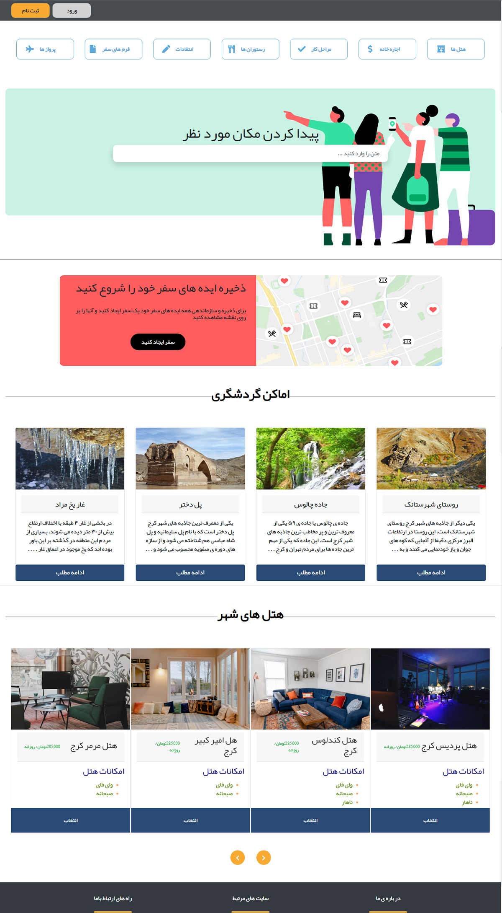

# Tourist Website Template

This project is a tourist website template built using **React**, **Bootstrap**, and **Firebase**. The template includes features such as a homepage, search section, display of tourist locations, and user registration and login functionality.
This is a sample project description.



## Technologies Used
- **React**: For building dynamic components and state management.
- **Bootstrap**: For responsive design and user interface.
- **Firebase**: For authentication management and data storage.

## Features
- Responsive design for mobile and desktop.
- Authentication with Firebase (Login and Sign Up).
- Display of tourist locations with images and descriptions.
- **React Router** for managing routes.

## Installation and Setup
1. Clone the project:
   ```bash
   git clone https://github.com/username/repository-name.git
